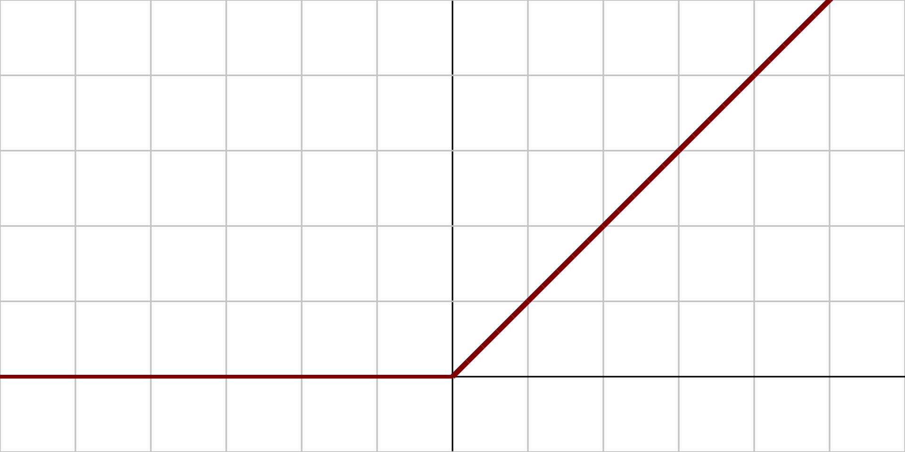
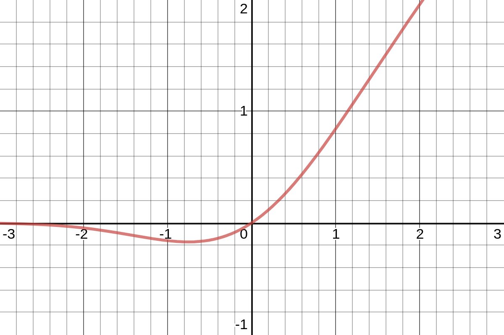
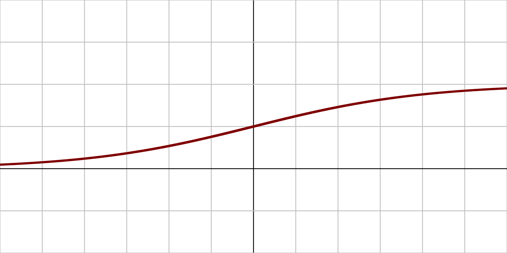
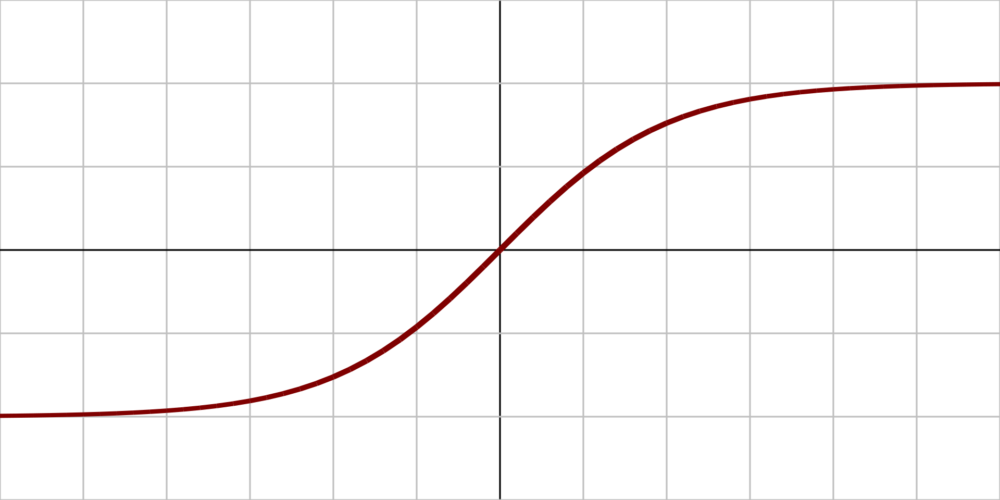

- ## Rectified Linear Unit (ReLU)
	- $\text{ReLU}(x)=max(0,x)$
	- {:width 400}
- ## Gaussian Error Linear Unit (GELU)
	- $\text{GELU}(x)=\cfrac{1}{2}(1+erf(\cfrac{x}{\sqrt{2}}))$
	- {:width 400}
- ## Sigmoid
  id:: 62f12694-5c6c-4fce-93cc-e092d8ec7184
	- $\sigma(x)=\cfrac{1}{1+e^{-x}}$
	- {:width 400}
- ## Hyperbolic Tangent (tanh)
  id:: 62f12694-fe6f-4363-aa50-91f06e04ef2a
	- $\text{tanh}(x)=\cfrac{e^x-e^{-x}}{e^x+e^{-x}}$
	- {:width 400}
- ## Softmax
	- $\text{softmax}(x)_i=\cfrac{e^{x_i}}{\sum_j e^{x_j}}$