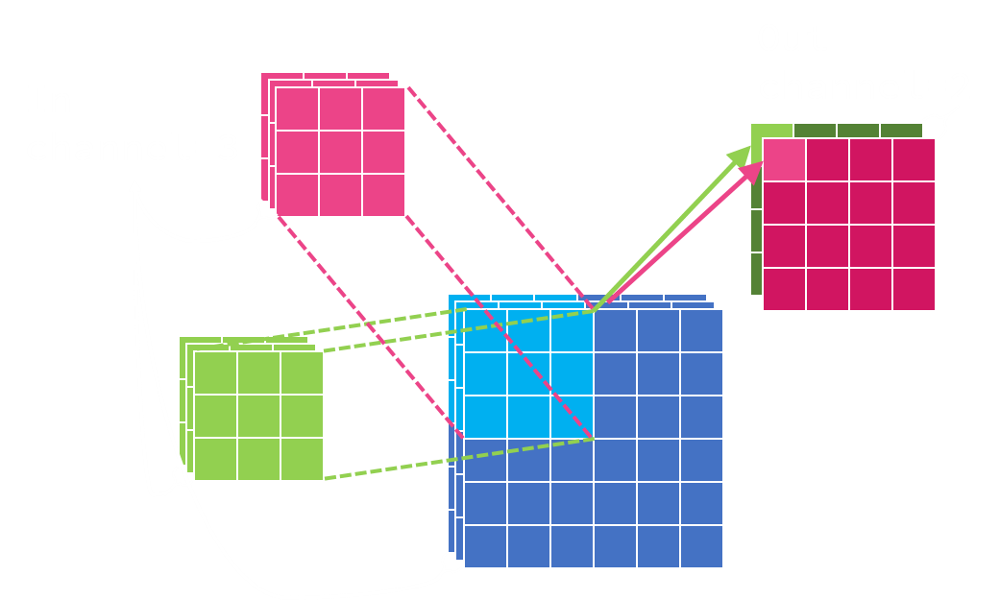
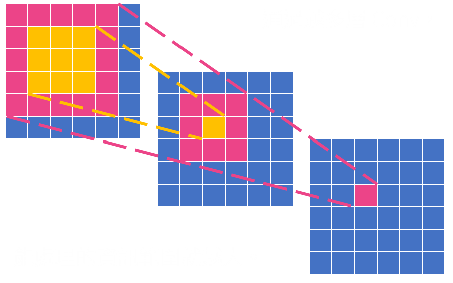
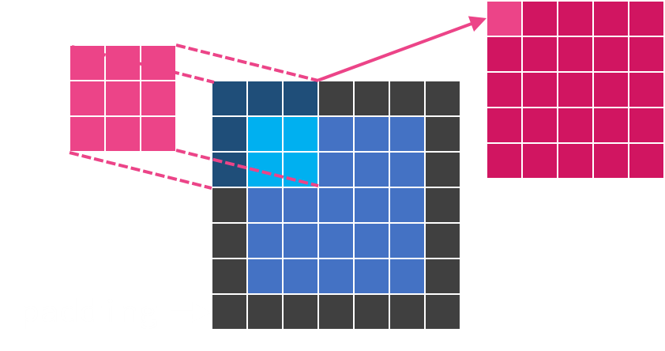
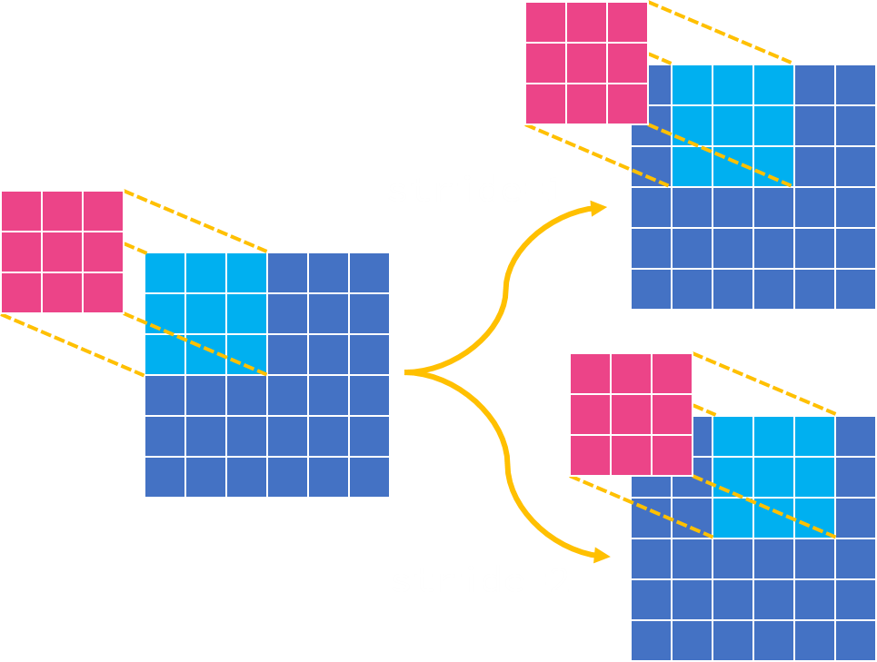
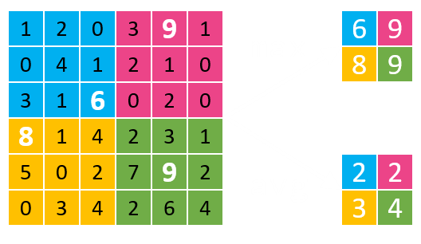

- ## 特點
	- 與 [[Multilayer Perceptron]] 相比具有平移不變性
	- 相比 [[RNN]] 具有高度平行化
	- 感受野（Receptive Field）內的資訊不會遺失
		- 但無法取代以外的資訊
		- 感受野大小在設計架構時就已經確立
	- 訓練所需的資料量比 [[Transformer Block]] 更少
- ## CNN 模型結構
	-
- ## 細節
	- Convolution
		- {:width 500}
		- {:width 500}
			- [DEMYSTIFYING DEEP LEARNING: PART 8, Convolutional Neural Networks](https://mukulrathi.com/demystifying-deep-learning/convolutional-neural-network-from-scratch/#interpretation-2-a-sliding-filter-over-the-image)
	- Receptive Field
		- {:width 450}
	- Padding
		- {:width 400}
	- Stride
		- {:width 450}
	- Pooling
		- {:width 400}
		- {{video https://youtu.be/fApFKmXcp2Y}}