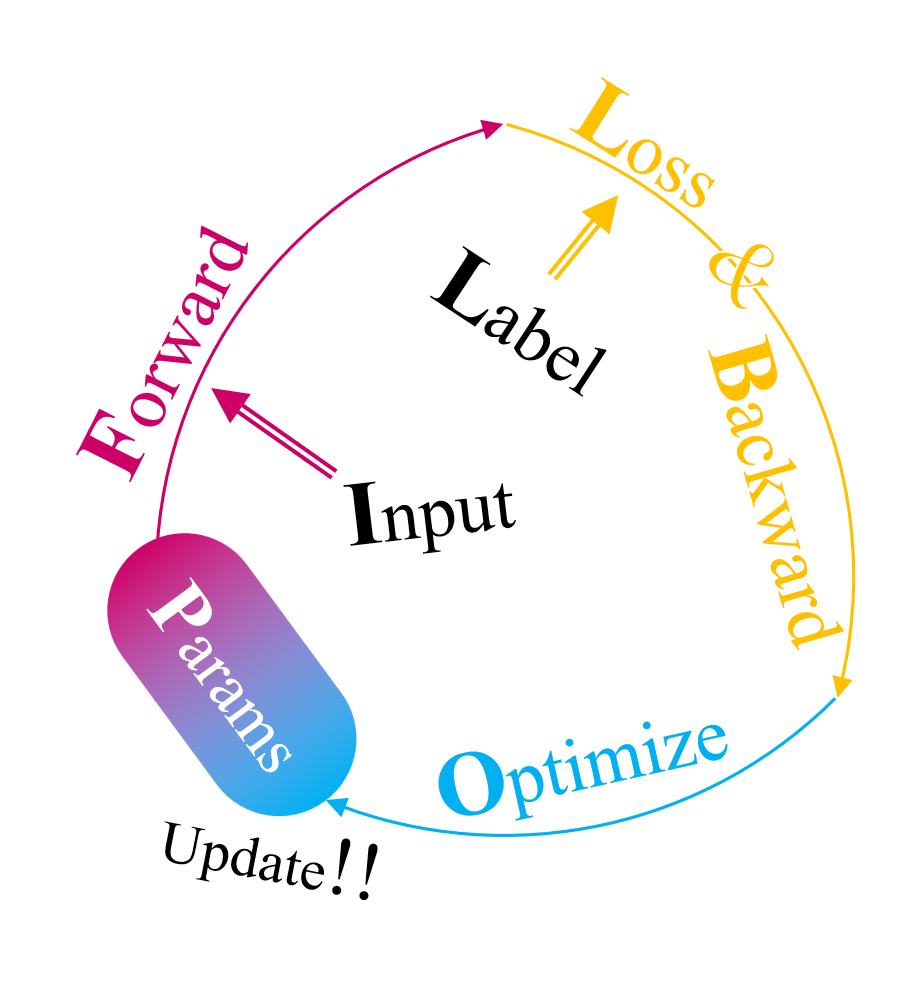

## Non-linear #[[Non-linear]]
	- Deep Learning 的模型需要將非線性函數（激活函數, activation function）穿插在線性運算（e.g. Linear Layer, Convolutional layer）之間，建構的模型才能解決非線性問題
- ## Deeper or Wider
	- ### Deeper
		- 在 [[AI&ML&DL]] 提到了 $f_{\phi}$ 是由數層的 Neural Network 所建構
			- 在每層逐步提取不同的 feature vector，可以學習不同層次的抽象特徵，能使其具有更佳的泛化能力
			  id:: 62ee231a-a676-43d6-8a43-55a1820c9e11
	- ### Wider
		- 理論上只要有 **足夠** 的資料，便可以靠 **非常寬**、只有一層隱藏層的 [[Multilayer Perceptron]] (MLP) 擬合任何的函數
			- 然而 wide neural network 的泛化能力低落，只是將資料記憶在網路中而已
			- 需要 **非常大量** 的資料與參數才能讓 wide neural network 擁有與 deep neural network 相等的能力
	- 相關研究可參考
		- [Why Deep Neural Networks for Function Approximation?](https://arxiv.org/abs/1610.04161)
		- [Universal approximation theorem](https://en.m.wikipedia.org/wiki/Universal_approximation_theorem)
- ## 訓練流程
	- {width 500}
	- ### Forward #Architectures
	- ### Loss #Loss
	- ### Backward #Backward
	- ### Optimize #Optimization
- ## ML/DL 三大方法
	- ### Supervised Learning #Supervised
		- 具有人工標記的 label
		- #### 衍生 [[Semi-Supervised]]
			- 使用人工標記與機器標記兩種資料進行訓練
	- ### Unsupervised Learning #Unsupervised
		- 缺乏人工標記的 label
		- 生成模型、分群（Clustering）等任務皆使用 Unsupervised Learning 的方式訓練
		- #### 衍出 [[Self-Supervised]]
			- 使用未標記資料訓練高泛化能力的 Pre-trained Feature Extraction
	- ### Reinforcement Learning #[[Reinforcement Learning]]
- Pretrain & Transfer Learning
- ## Task
	- {{embed [[Image]]}}
	- {{embed [[Text]]}}
	- {{embed [[Audio]]}}
	- {{embed [[3D Scene]]}}
	  collapsed:: true
- ## Dataset
	- 3D 資料集
		- 人體姿態捕捉
			- https://dna-rendering.github.io/
			- https://github.com/BandaiNamcoResearchInc/Bandai-Namco-Research-Motiondataset
		- https://ommo.luchongshan.com/
		- https://casual-effects.com/data/
		-
	- 文字
	  id:: fd8029e1-87e4-4a79-aadb-afc4392421f9
		- PG-19
		- New The Pile
		- RedPajama-Data-1T
		- RedPajama-Data-1B
		- https://huggingface.co/datasets/cerebras/SlimPajama-627B
		- https://huggingface.co/datasets/tiiuae/falcon-refinedweb
		- [TMMLU+](https://huggingface.co/datasets/ikala/tmmluplus): 繁體中文的語言模型新基準資料集
		  [https://blog.infuseai.io/tmmluplus-dataset-brief-introduction-ecfd00297838](https://blog.infuseai.io/tmmluplus-dataset-brief-introduction-ecfd00297838)
		- [MathPile](https://gair-nlp.github.io/MathPile/)
	- 語音
		- [LibriSpeech](https://www.openslr.org/12)
			- 982h; 16kHz; 2,484 spk;
		- [LibriTTS](https://www.openslr.org/60/)
			- 586h; 24kHz; 2,456 spk;
		- [LibriTTS-R](https://www.openslr.org/141/)
			- The constituent samples of LibriTTS-R are identical to those of LibriTTS, with only the sound quality improved.
		- [LibriLight](https://github.com/facebookresearch/libri-light)
			- 由少量的 labelled data 與 大量的 unlabelled data 組成
			- Labelled Data
				- a small training set for limited supervision (10h, 1h or 10 minutes of labelled speech)
			- Unlabelled Data
				- The unlabelled data is spit into 3 subsets of increasing sizes (small, medium, large) in order to facilitate experimentation on smaller amounts of data (further, downloading the large dataset may take several days).
				- [small.tar (577 hours, 35 GB)](https://dl.fbaipublicfiles.com/librilight/data/small.tar)
					- md5: `c49207eb86a8e8ac895561c37232041e`
				- [medium.tar (5193 hours, 321 GB)](https://dl.fbaipublicfiles.com/librilight/data/medium.tar)
					- md5: `c75e7ac62471bfbf2db77528d62a9b74`
				- [large.tar (51934 hours, 3.05 TB)](https://dl.fbaipublicfiles.com/librilight/data/large.tar)
					- md5: `4dfbac018f50b99797ece101fc9f0c30`
				- We additionally provide a 4th subset containing potentially duplicated books.
					- [unlab_duplicate.tar (4500 hours, 274 GB)](https://dl.fbaipublicfiles.com/librilight/data/duplicate.tar)
				- By combining these subsets, one can construct the 3 splits described in the Libri-Light paper:
					- *unlab-60k* : small + medium + large
					- *unlab-6k* : small + medium
					- *unlab-600* : small
		- [VCTK](https://datashare.ed.ac.uk/handle/10283/3443)
			- 44h; 48kHz; 109 spk
			- [96kHz](https://datashare.ed.ac.uk/handle/10283/2774)
		- [LJ Speech](https://keithito.com/LJ-Speech-Dataset/)
			- 25h; 22.05kHz; 1 spk
		- [TIMIT](https://github.com/philipperemy/timit)
		- [VoxCeleb](https://www.robots.ox.ac.uk/~vgg/data/voxceleb/)
		- [Common Voice](https://commonvoice.mozilla.org/zh-TW)
	- 吵雜語音
		- [VCTK + DEMAND](https://datashare.ed.ac.uk/handle/10283/2791)
	- 音訊
		- [AudioSet](https://research.google.com/audioset/dataset/index.html)
			- 來自 Youtube 的標記影音片段
		- [[PopBuTFy]]
	- 圖片
		- ImageNet
		- CIFAR
		- MNIST
		- [LAION](https://laion.ai/)
	- 影片
		- https://www.di.ens.fr/willow/research/surreal/data/
			- A large-scale dataset with synthetically-generated but realistic images of people rendered from 3D sequences of human motion capture data. We generate more than 6 million frames together with ground truth pose, depth maps, and segmentation masks.
- ## 推薦期刊、會議
	- NLP
		- IJCAI
		- ACL
		- EMNLP
		- IEEE/ACM Transactions on Audio, Speech, and Language Processing
		- COLING
	- 語音
		- INTERSPEECH
		- ICASSP
		- IEEE/ACM Transactions on Audio, Speech, and Language Processing
	- 影像
		- ICCV
		- CVPR
	- 多媒體
		- ICME (IEEE International Conference on Multimedia and Expo)
	- 機器學習
		- NIPS
		- AAAI
		- ICLR
		- ICML
- [[template]]