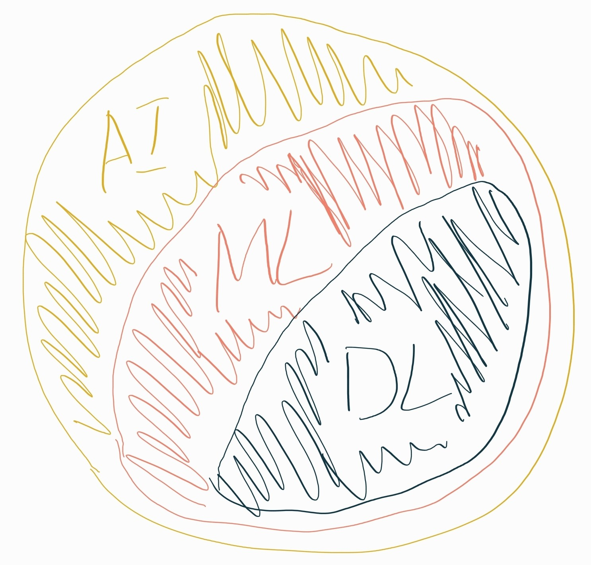

- 在 [[AI&ML&DL]] 中提到了 $f,\phi,x,y$
	- 為了透過資料 $x$ 與 $y$ 找出最佳的參數 $\phi$
	  我們還需要定義損失函數 $\mathcal{L}$ 
	  來計算 $f_{\phi}(x)$ 與目標 $y$ 之間的差距
- [[Optimization]]
- [[Non-linear]]
- [[Architectures]]
- 我們將實作的細節抽象為
	- $\mathcal{L}$：損失函數
	- $f$：模型
	- $\phi$：參數
	- $x$
	- $y$
- Gradient Descent
	- $\phi\leftarrow\phi-\gamma\cfrac{\partial \mathcal{L}(f,data,\phi)}{\partial \phi}$
	- $\phi\leftarrow\phi-\gamma\cfrac{\partial \mathcal{L}(f_{\phi}(x),y)}{\partial \phi}$
- $D=\{(x_1,y_1), (x_2,y_2),...(x_n,y_n)\}$
- [[Supervised]]
	- y 是人為標記的 label
- [[Unsupervised]]
	- 沒有人為標記的 y
- [[Semi-Supervised]]
	- 使用人工標記與機器標記兩種資料進行訓練
- $y=f(x)$
	- AI/ML/DL 其實就是找出讓 y = f of x 成立的函數 f
- $y=f(\phi,x)$
	- 而 ML 中得 f 的架構，要讓其正確的運作還需要參數 $\phi$
	- $=(f_n(\phi_n)\circ\cdots\circ f_2(\phi_2)\circ f_1(\phi_1))(x)$
		- 而 DL 的模型架構 f，就是由多層的 neural network 組合成的
- 