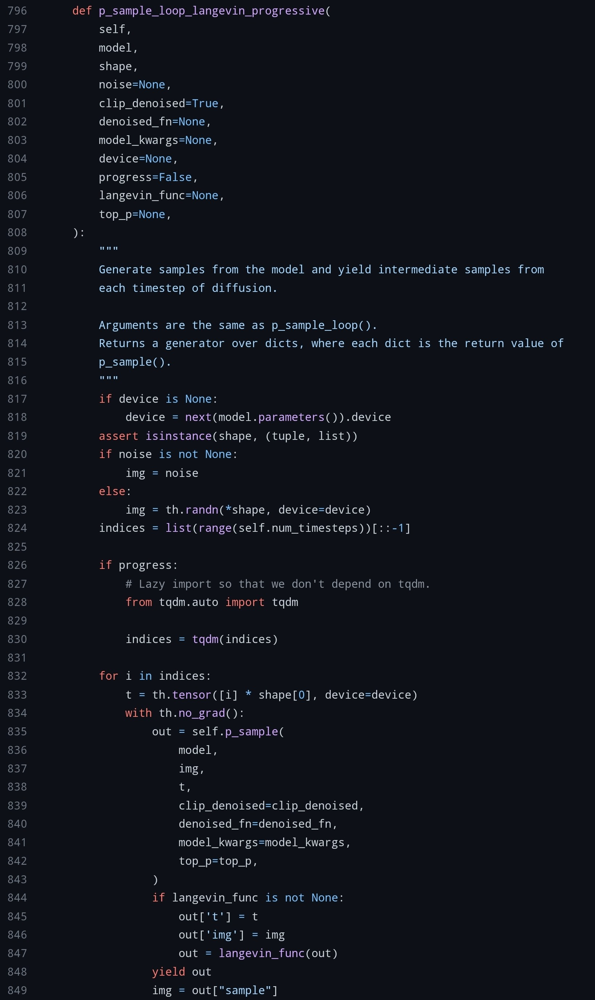
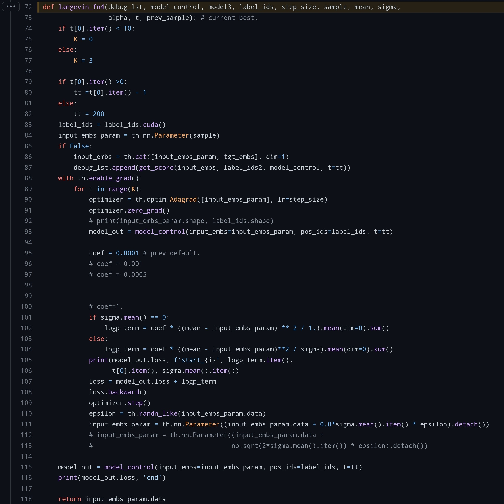
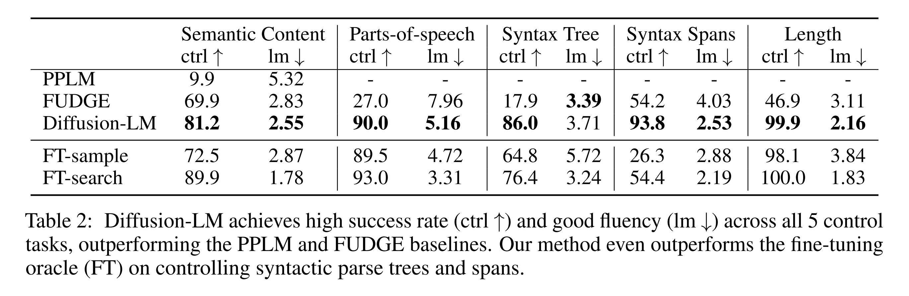
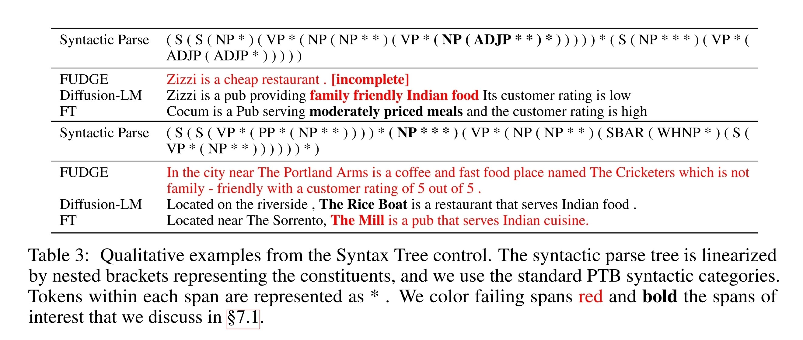
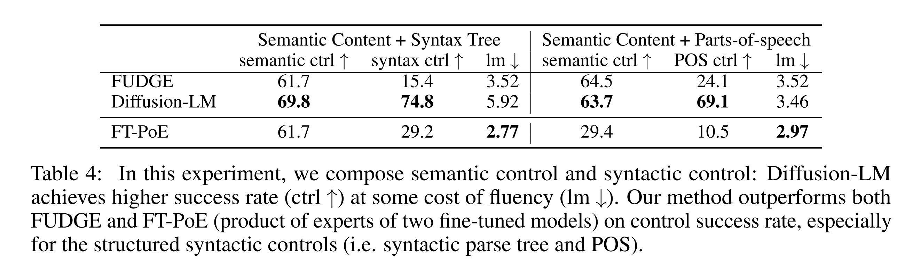
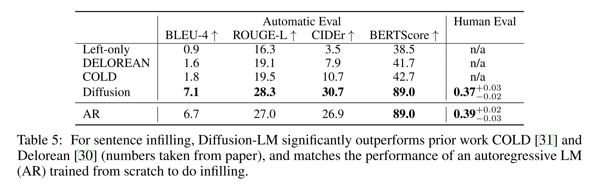
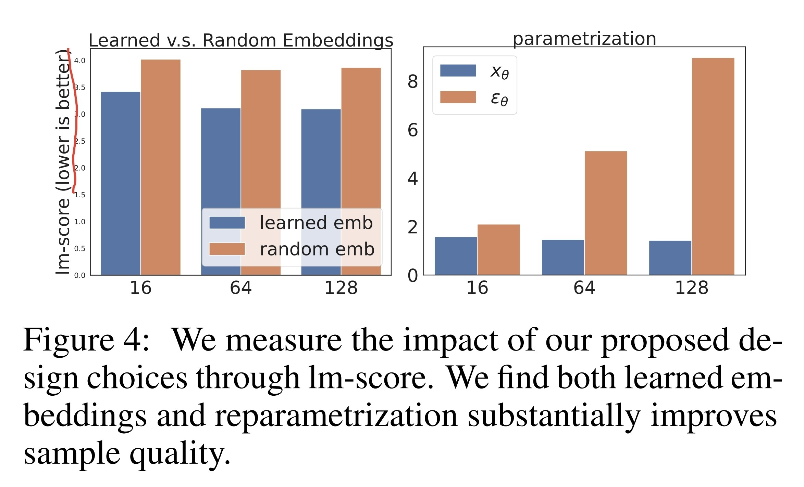

- ## Info
	- tag: #DPM
	- [Diffusion-LM Improves Controllable Text Generation](https://arxiv.org/abs/2205.14217)
	- [source link](https://github.com/xiangli1999/diffusion-lm)
- ## Introduction
	- 預訓練的大型 AR-LM 能生成高品質的文本，但是為了能應用到日常生活，需要能控制生成的文本
		- 常見使用 (condition, text) 的形式來微調模型
			- 但是，為每種任務都更新 LM 參數的成本高昂，並且也難以組合複數種條件
				- e.g. generate text that is both positive sentiment and non-toxic.
		- Plug & Play #PPLM 可以在保持 LM 固定的情況下控制生成，但是目前的 Plug & Play 僅能夠進行簡單的控制（像是情緒或主題那種屬性級別的條件）
	- 近期在影像與音頻的可控性生成研究中，基於 Continuous Diffusion Models 的方法在生成品質與可控性上都有非常出色的表現。
		- 然而文本的離散性質，使其尚未能與
	- 為了能進行更複雜的控制，本研究提出了基於連續擴散模型的 Diffusion-LM
- 以往基於 autoregressive LMs 的方法，即使配合 Plug and Play 也難以做到細膩的生成控制
	- 提出基於 DPM 的 LM 能很好的改善這個問題
- 此研究使用 $\mu_{\theta}(x_t,t)$ 直接預測去除 noise 後的結果，而非像常見的 DPM 一樣使用 $\epsilon_{\theta}(x_t,t)$ 來推估加入的 noise
- ## Loss
	- $\mathcal{L}^\text{e2e}_\text{vlb}(\text{w})=\underset{q_{\phi}(\text{x}_0|\text{w})}{\mathbb{E}}[\mathcal{L}_\text{vlb}(\text{x}_0)+\log q_{\phi}(\text{x}_0|\text{w})-\log p_{\theta}(\text{w}|\text{x}_0)]$
		- $\mathcal{L}_\text{vlb}(\text{x}_0)=\underset{q(\text{x}_{1:T}|\text{w})}{\mathbb{E}}\Bigg[\log\cfrac{q(\text{x}_T|\text{x}_0)}{p_{\theta}(\text{x}_T)}+\sum_{t=2}^T \log\cfrac{q(\text{x}_{t-1}|\text{x}_0,\text{x}_t)}{p_{\theta}(\text{x}_{t-1}|\text{x}_t)}-\log p_{\theta}(\text{x}_0|\text{x}_1)\Bigg]$
	- 由於 $\mathcal{L}^\text{e2e}_\text{vlb}(\text{w})$ 需要搭配許多 trick 才能穩定收斂，因此本論文改採用 $\mathcal{L}^\text{e2e}_\text{simple}(\text{w})$ 作為 loss（推導源於 #DDPM
	- $\mathcal{L}^\text{e2e}_\text{simple}(\text{w})=\underset{q_{\phi}(\text{x}_{0:T}|\text{w})}{\mathbb{E}}[\mathcal{L}_\text{simple}(\text{x}_0)+{||EMB(\text{w})-\mu_{\theta}(\text{x}_1,1)||}^2-\log p_{\theta}(\text{w}|\text{x}_0)]$
		- $\mathcal{L}_\text{simple}(\text{x}_0)=\sum_{t=1}^T \underset{q(\text{x}_t|\text{x}_0)}{\mathbb{E}}{||\mu_{\theta}(\text{x}_t,t)-\hat{\mu}(\text{x}_t,\text{x}_0)||}^2$
- ## Controllable Generation
	- 使用 Minimum Bayes-Risk (MBR) 進行解碼
	- $\nabla_{x_{t-1}}\log p(x_{t-1}|x_t,c)=\nabla_{x_{t-1}}\log p(x_{t-1}|x_t)+\nabla_{x_{t-1}}\log p(c|x_{t-1})$
		- 前項的 $\nabla_{x_{t-1}}\log p(x_{t-1}|x_t)$ 是 diffusion model 輸出的梯度。
		  （對應 ((635e8deb-bd02-45c0-8e20-e9b9235f687c)) 835~843 行）
		- 後項的 $\nabla_{x_{t-1}}\log p(c|x_{t-1})$ 則是 Classifier Guidance 提供的梯度。
		  （對應 ((635e8deb-bd02-45c0-8e20-e9b9235f687c)) 847 行與 ((635e7d11-bb0d-4223-a2c2-6de04caf06fc)) 的 code）
			- 論文中為了增加生成品質，在後項提出了 **fluency regularization**, **multiple gradient steps** 兩個 Trick。
			  詳情在下一段說明。
	- ### Source Code about Reverse Step
	  id:: 635e8deb-bd02-45c0-8e20-e9b9235f687c
		- 
			- https://github.com/XiangLi1999/Diffusion-LM/blob/49eab39c240734b2a6f1157de282b7f277c6639c/improved-diffusion/improved_diffusion/gaussian_diffusion.py#L796
	- ### Source Code about Classifier Guidance
	  id:: 635e7d11-bb0d-4223-a2c2-6de04caf06fc
		- 
			- https://github.com/XiangLi1999/Diffusion-LM/blob/759889d58ef38e2eed41a8c34db8032e072826f4/improved-diffusion/scripts/infill_util.py#L72
			- 90~111 行的部分對應論文 5.1 節提到的
				- > To improve performance on text and speed up decoding, we introduce two key modifications: **fluency regularization** and **multiple gradient steps**.
				- $\lambda \log p(x_{t-1}|x_t)+\log p(c|x_{t-1})$
					- 101~104 行的 `logp_term` 對應上式的 $\lambda \log p(x_{t-1}|x_t)$，也就是 **fluency regularization** 的部分。
					  應該跟 PPLM 的 KL loss 具有相同的意義，用來避免引導到超出正常語言結構。
				- **multiple gradient steps** 的概念與 [[Score-Based Generative Modeling through Stochastic Differential Equations]] 的 Predictor-Corrector (PC) sampling 有些類似，都是透過在 reverse process 之間插入額外的修改步驟來提高生成的結果。
- ## Experiment Setup
	- ### Control tasks
		- #### Classifier-Guided
			-
		- #### Classifier-Free
			-
- ## Main Results
	- 
	- 
	- 
	- 
	- 