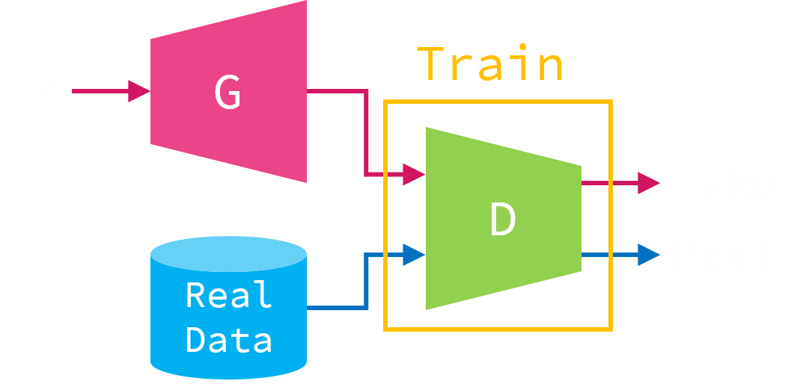
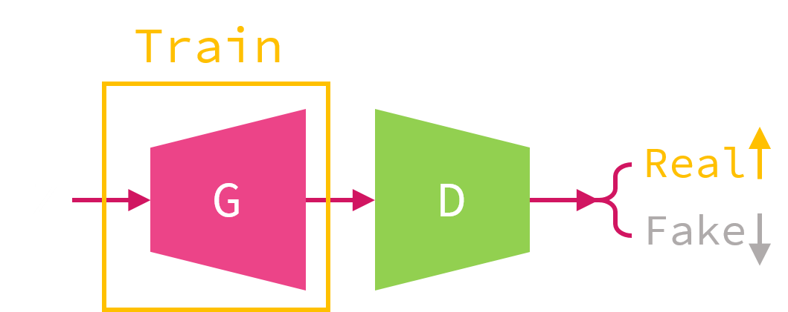
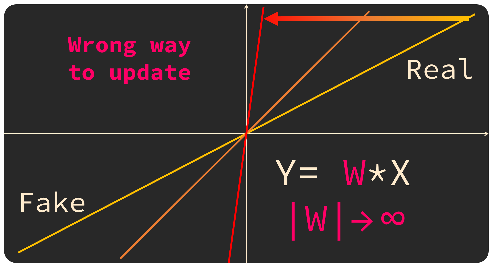
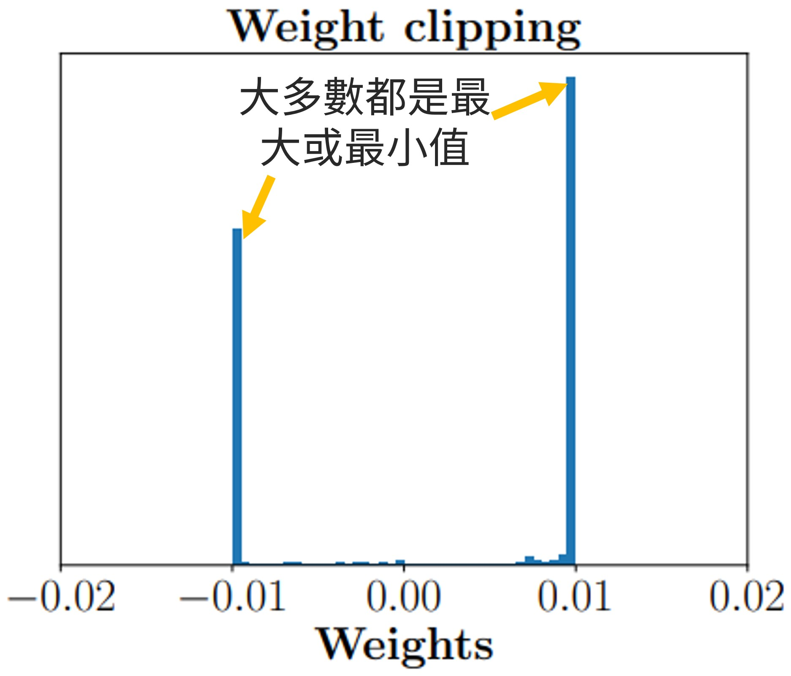

- ## 標準 GAN
	- Generator $G$ 使用從常態分佈取樣的 latent vector $z$ 作為輸入，並期望能生成出逼近真實資料的輸出
		- 然而在訓練資料中並沒有將 $z$ 與真實資料配對，
		  導致無法使用 Supervised Learning 的方式訓練 Generator
	- Generative Adversarial Network（GAN）導入了 Discriminator $D$ 幫助訓練 Generator，
	  藉由 Discriminator 的幫助，隱式的將 $z$ 與真實資料連結起來
		- 在訓練過程中無需知道與 $z$ 配對的真實資料，
		  而是將 Discriminator 視為 Loss，讓 $G(z)$ 的生成結果逼近 Real
	- ### 訓練流程
		- 在 GAN 的訓練流程中會重複循環以下兩步驟
			- {:width 450}
				- Discriminator 目的是要能區分真實資料與生成資料
				- 在訓練 Discriminator 的梯度不會去修改 Generator
			- {:width 480}
				- Generator 的目標是讓 Discriminator 將生成樣本判斷成真實資料
				- 將整個 Discriminator 當成 Loss Function 的一部分
	- ### 缺陷
		- 在原版的 GAN 中在 Discriminator 的輸出使用了 [Sigmoid](((62f12694-5c6c-4fce-93cc-e092d8ec7184))) 這類有界的函數，
		  導致當 Discriminator 訓練過度時會發生梯度消失的問題。
			- {:width 600}
				- 當 Discriminator 太強的時候，通過 Sigmoid 的輸出會接近 0 與 1，
				  此時回傳給 Generator 的梯度便會接近於 0
			- 這時候原本要用於訓練 Generator 的梯度亦會跟著消失，
			  最終讓整個 GAN 的訓練流程崩潰。
		- 上述缺陷在後來的 WGAN、CTGAN、SN-GAN、Boundary Equilibrium GAN 等等方法上得到改善
- DCGAN
- ## WGAN
	- 將 Discriminator 改成 Critic（即移除 Sigmoid 的 Discriminator）
		- 用無上下限的分數來評估樣本真實度
		- 使用 clipping 限制 Critic 的參數大小，以保證數學前提
			- {:width 500}
				- 如果沒有設限，Critic 可以以簡單的透過調整參數大小來拉開分數
			- {:width 350}
				- 簡單的使用 clipping 限制 Critic，會導致 Critic 大多數參數是最大或最小值
				  使其對 Generator 的變化不敏感，而發生 mode collapse（生成多樣性極低）
	- ### WGAN-GP
		- 改使用 gradient penalty loss 限制 Critic 回傳的梯度大小，解決了 clipping 的問題
	- ### WGAN-div
- Controllable
	- conditional GAN：需要類別標籤
	- InfoGAN
- PGGAN：從小→→大漸進式堆疊網路並訓練，以加快訓練速度與穩定性。
- SeqGAN：將 GAN 應用於序列生成上。
- VQGAN：結合 Transformer 與 VQVAE 的 GAN，能產生高解析度的輸出。