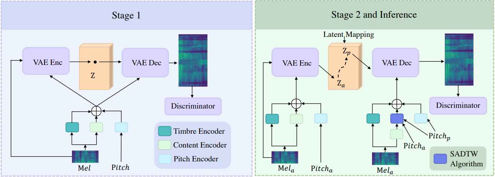

## Info
	- tag:
	- [paper link](https://aclanthology.org/2022.acl-long.549/)
	- source link: [official](https://github.com/MoonInTheRiver/NeuralSVB)
	- [demo](https://neuralsvb.github.io/)
	- previous version:
	- next version:
	- dataset: [[PopBuTFy]]
- 
	- The overview of NVSB. The training process consists of 2 stages, and the second stage shares the same
	  pipeline with the inference stage. “VAE Enc” means the encoder of CVAE; “VAE Dec” means the decoder of
	  CVAE; “Mel” means the mel-spectrogram; “z” means the latent variable of the vocal tone; the “a”/“p” subscript
	  means the amateur/professional version.