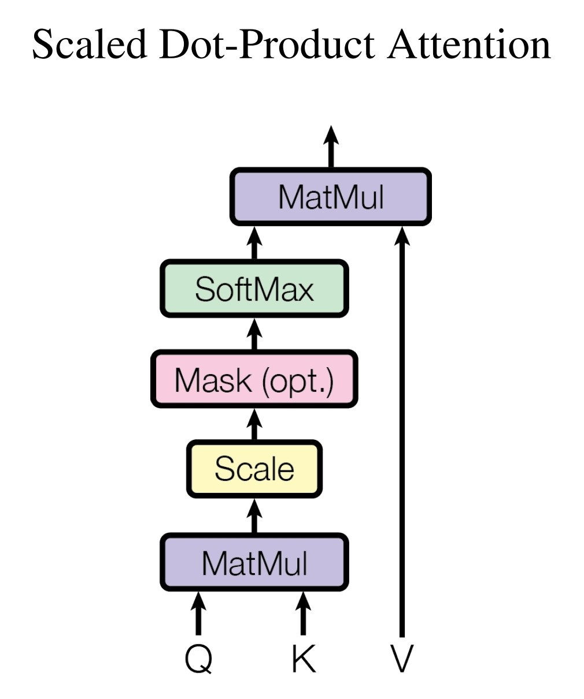
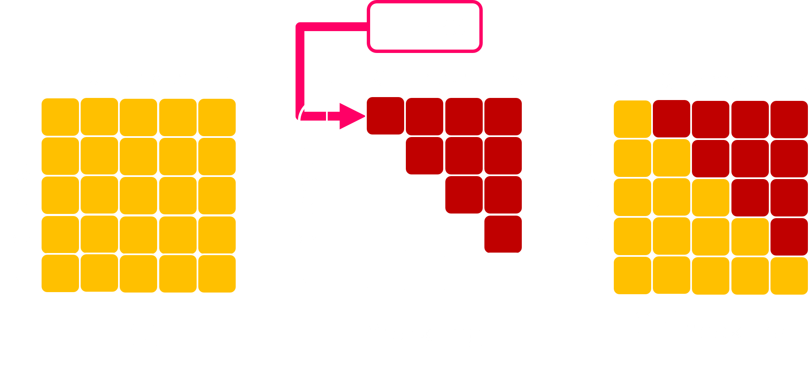
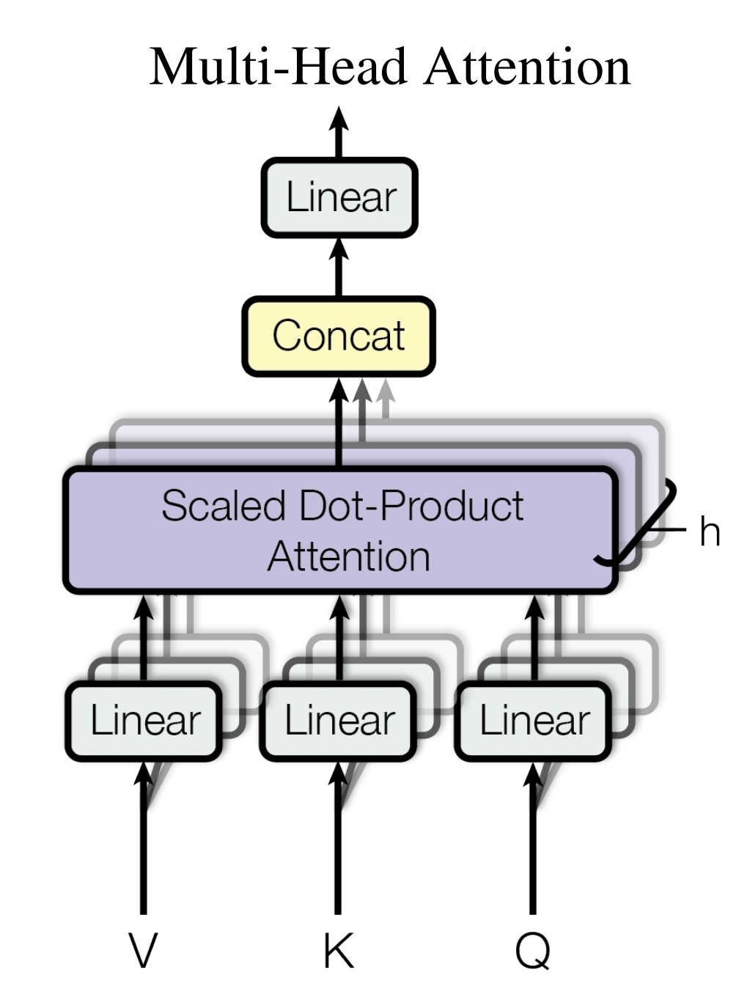

- [Attention is all you need](https://papers.nips.cc/paper/2017/hash/3f5ee243547dee91fbd053c1c4a845aa-Abstract.html), NIPS, 2017
- ## 特點
	- 能藉由 mask 對 attention map 附加各種操作，具有高度彈性
	- ### vs RNN
		- 平行化處理所有輸入
		- 不會遺忘資訊
	- ### vs CNN
		- 動態、全域級別的感受野
	- ### 缺陷
		- 具有 $O(L^2)$ 的複雜度
- ## Scaled Dot-Product Attention
	- {:width 300}
		- Keys 與 Value 是成對的
		- 計算所有 Querys 與 Keys 之間的相似度，再將相似度對 Value 做加權平均
	- ### 計算流程
		- $\textbf{Input}~Q\in\mathbb{R}^{L\times d_k},~K\in\mathbb{R}^{T\times d_k},~V\in\mathbb{R}^{T\times d_v},~M\in\mathbb{R}^{L\times T}$
			- $M$ 是 mask，用來限制可以被看見的範圍
				- 例如用來遮蔽未來的資訊，使其能夠用於 [[Autoregression]]
					- {:width 500}
				- 又或者遮蓋 padding 的位置
					- 使用時序資料訓練時不會每筆資料的長度都一樣，這時候為了能放在同一個 batch 訓練，就必需要作 padding 或是 clipping，在 padding 的位置加上 mask 就能避免 padding 的資訊參與到訓練中
		- $\textbf{Output}~o\in\mathbb{R}^{L\times d_v}$
		- $\textbf{Forward}$
			- $A\leftarrow \text{softmax}(\cfrac{Q\cdot K^{\top}}{\sqrt{d_k}}+M)$
				- $A\in\mathbb{R}^{L\times T}$
			- $o\leftarrow A\cdot V$
- ## Multi-Head Attention
	- {:width 300}
		- 使用多個不同的線性轉換後在分開執行 Scaled Dot-Product Attention
		- 相當於 Convolution 中使用多個 kernel 抽取不同的資訊
	- ### 計算流程
		- $\textbf{Input}~Q_{\text{in}}\in\mathbb{R}^{L\times i_q},~K_{\text{in}}\in\mathbb{R}^{T\times i_k},~V_{\text{in}}\in\mathbb{R}^{T\times i_v},~M\in\mathbb{R}^{L\times T}$
		- $\textbf{Output}~o\in\mathbb{R}^{L\times d_o}$
		- $\textbf{Params}~W^{(i)}_q\in\mathbb{R}^{d_k\times i_q},~W^{(i)}_k\in\mathbb{R}^{d_k\times i_k},~W^{(i)}_v\in\mathbb{R}^{d_v\times i_v},~W^{\top}_o\in\mathbb{R}^{d_o\times nd_v}$
			- $n$ 表示 head 的數量
		- $\textbf{Forward}$
			- $Q^{(i)},~K^{(i)},~V^{(i)}\leftarrow Q_{\text{in}}W^{(i)\top}_q,~K_{\text{in}}W^{(i)\top}_k,~V_{\text{in}}W^{(i)\top}_v$
			- $h^{(i)}\leftarrow \text{SDPAttn}(Q^{(i)},K^{(i)},V^{(i)},M)$
			- $h\leftarrow concat(h^{(1)},h^{(2)},\cdots,h^{(n)})$
				- $h\in\mathbb{R}^{L\times nd_v}$
			- $o\leftarrow hW^{\top}_o$
- ## 補充
	- [[Efficient Transformers]]