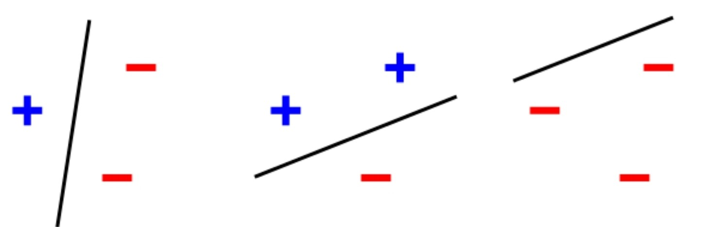
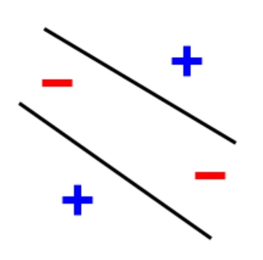

- > 線性：$\alpha f(x_1)+\beta f(x_2)=f(\alpha x_1+\beta x_2)$
- ## 線性的局限性
	- ### 感知器（Perceptron）
		- 最簡單的人工神經網絡
		- 由一層 Linear Layer 構成 **線性分類器**
			- 只能解決線性可分（Linear separability）的問題
				- {:width 360} vs {:width 120}
	- ### Linear Layer (Fully Connected Layer)
		- $f(x)=xW^{\top}+b,~\text{where}~x\in\mathbb{R}^m,~W\in\mathbb{R}^{n\times m},~b\in\mathbb{R}^n$
			- $m$ 與 $n$ 代表輸入與輸出的維度
		- 由多 $l$ 層 linear layer 疊加成的模型可以表示成
		  （為了方便表示，先隱藏 bias $b$）
			- $(f_l\circ\cdots\circ f_2\circ f_1)(x)= xW_1^{\top}W_2^{\top}\cdots W_l^{\top}=xW^{\top}$
			- **其能力與單層的 linear layer 相當**
	- ### 局限性
		- 現實環境中需要面對大量的 **非線性（non-linear）**問題
			- 這些問題無論堆疊多少層的 Linear Layer 都無法解決
	- **注意！**只要符合開頭的定義就是線性運算單元，並非只有 Linear Layer。
	  像是 convolution 也符合該定義。
- ## Activation Function #[[Activation Function]]
	- 將 Linear Layer 轉換成非線性方法非常簡單
		- 只需要在每層之間多增加一個非線性運算即可
		- 這種運算函數 $\alpha(\cdot)$ 通稱為激活函數（Activation Function）
		- $(f_l\circ\alpha\circ\cdots\circ f_2\circ\alpha\circ f_1)(x)=\alpha(\cdots\alpha(\alpha(xW^{\top}_1)W^{\top}_2)\cdots) W^{\top}_l$
	- 這種由 Activation Function 與 Linear Layer 堆疊成的模型，
	  就是 DL 中最簡單的架構：Multilayer Perceptron（MLP） #[[Multilayer Perceptron]]