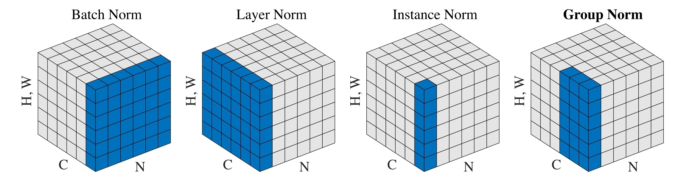
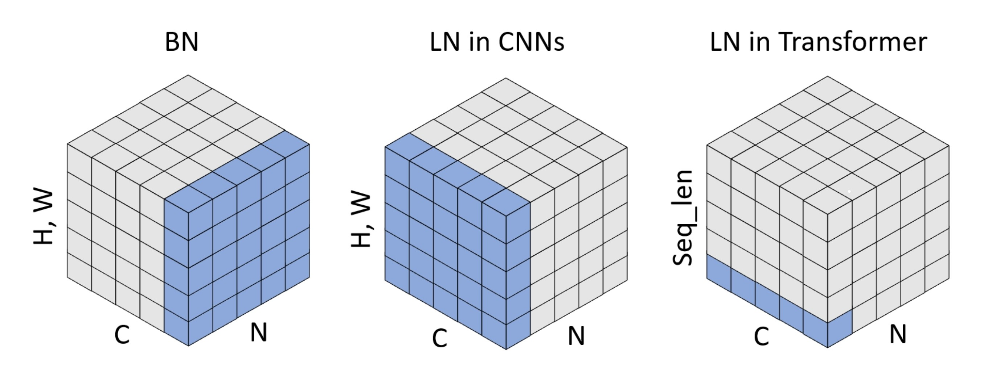

- {:width 700}
- Instance Normalization
- Layer Normalization
	- {:width 500}
		- [Leveraging Batch Normalization for Vision Transformers](https://ieeexplore.ieee.org/document/9607565)
		- **注意**：在 CNN 與 Transformer Block 中，LayerNorm 的計算的目標軸不同
- Batch Normalization
- Group Normalization
- Weight Standardization