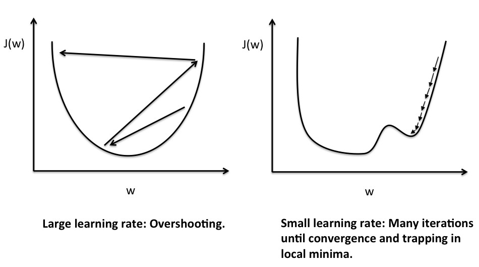
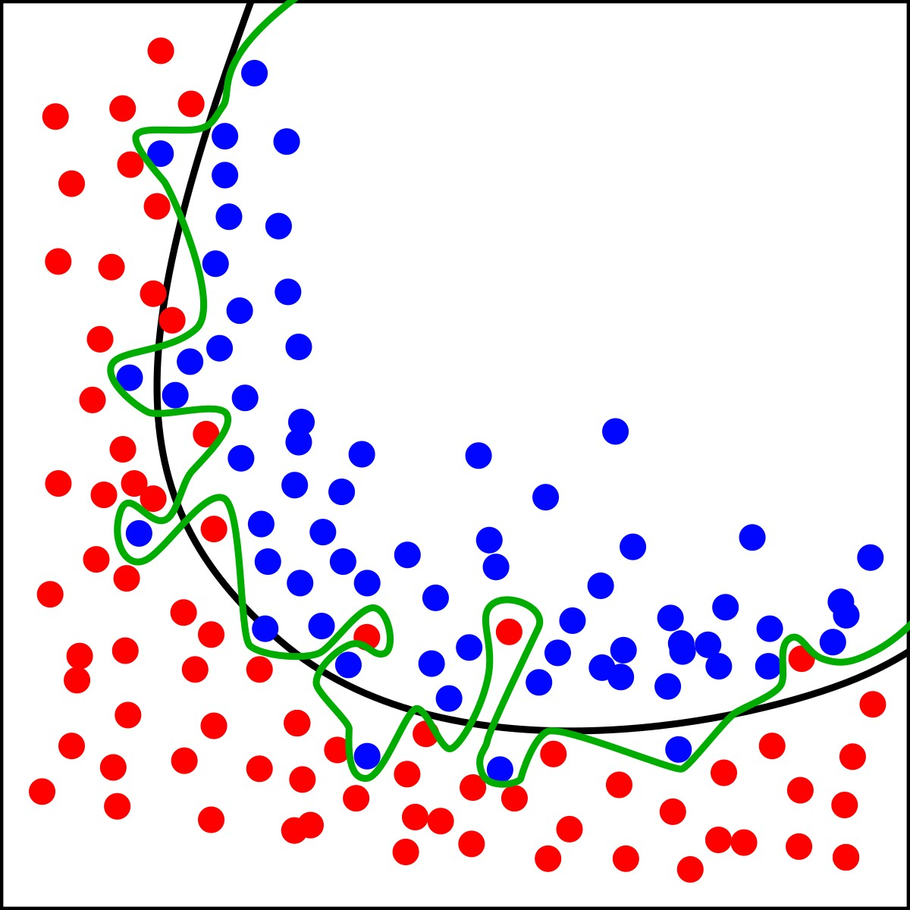
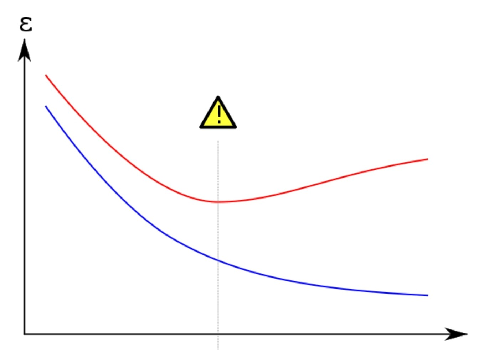

- 在訓練 DL 模型時，是將其視為連續函數的最佳化問題來求解，
  因此會在 [[Backward]] 使用到微分來計算參數 $\phi$ 的梯度並進行更新
- ## Loss #Loss
	- 模型的估測值 $f_{\phi}(x)$ 與實際目標 $y$（Ground Truth）之間的誤差值
		- 當誤差越小就代表估測結果越準確
		- **注意**：雖然以誤差值來解說，但 loss 沒有要求為正
			- 只要求**數值越小代表估測越好**
	- 依據任務由各式各樣的 loss function $\mathcal{L}$ 計算
- ## Gradient Descent
	- 為了通過梯度更新參數 $\phi$，$f_{\phi}$ 與 $\mathcal{L}$ 必須是可微
	- $\phi\leftarrow\phi-lr\cdot\cfrac{\partial \mathcal{L}(f_{\phi}(x),y)}{\partial\phi}$
		- learning rate $lr$ 用來調整更新的步幅大小
			- {:width 400}
			  太小會花費過多的訓練時間，也容易使 loss 卡在局部最小值
			  太大容易使模型震盪而不收斂
			- Momentum、Adamax 等等後續發明的方法會使用歷史梯度影響本次更新方向、大小，
			  做到動態調節 learning rate 的效果。
			- 也可以使用 scheduler 來控制 learning rate 的變化
	- Gradient Descent 會對 **整個資料集**（一個 epoch）計算 Loss 與梯度後才進行一次更新（一個 step）
		- 現代 DL 使用大型資料集訓練，用 GD 訓練模型的效率太低
	- ### Stochastic Gradient Descent
		- 在 GD 中每個 epoch 只更新一個 step 的訓練方式太過耗時
			- 為了減少訓練成本，Stochastic Gradient Descent（SGD）改成每個 step 都只**隨機**從資料集中抽取一小部分的資料訓練（一個 batch）
				- > 如果沒有隨機抽取，而是以固定順序選擇資料，會導致模型發生 overfitting
			- 這種方式使得一個 epoch 中可以更新更多的次數，減少訓練所耗費的時間
				- > 每個 epoch 的 step 數量 $=\cfrac{\text{資料集大小}}{\text{batch size}}$
		- Batch 的大小與 learning rate 一樣會影響收斂結果
			- 過大的 batch 需要更長的訓練時間
			- 過小的 batch 容易使模型震盪而不收斂
- ## Issue
	- ### Overfitting
		- {:width 300}
			- https://en.m.wikipedia.org/wiki/Overfitting
		- {:width 300}
			- https://en.m.wikipedia.org/wiki/Overfitting
			- 藍線是訓練誤差，紅線是驗證誤差
			  可以發現在虛線之後雖然訓練誤差還在下降，但驗證誤差卻開始上升
			- > 在訓練過程可使用驗證資料集確認有無發生 overfitting，
			  > 以方便在適合的時間點結束訓練
		- 容易發生與資料集較小，而模型結構卻太過複雜時
		- 會使得模型在訓練資料上表現優異，但卻在沒有看過的資料上效能低下
			- 泛化性（generalization）低
		- 使用 [dropout](((62efa794-4543-4b2c-bac4-0dd9ffef8401)))、[L1/L2 regularization](((62ee3508-a9db-4649-b2c6-a6b440a74fb0))) 與 [[Data Augmentation]] 可以在一定程度上避免 overfitting