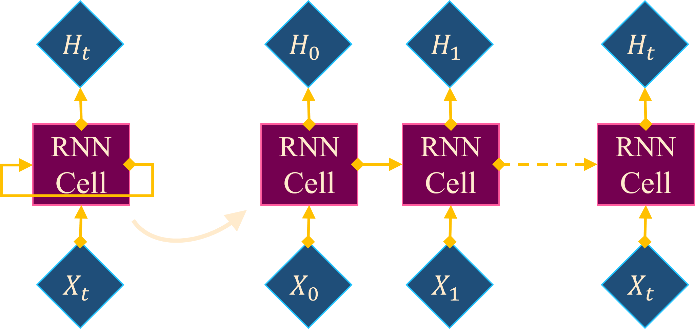
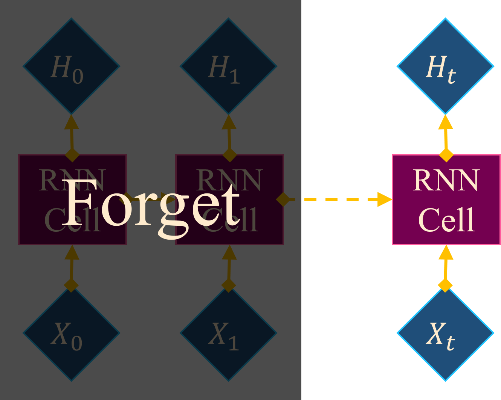

- ## Recurrent Neural Networks
	- ### 公式
		- $h_t=f(x_t,h_{t-1})=\alpha(x_tW^{\top}_x+h_{t-1}W^{\top}_h+b),$
			- $\text{where}~x\in\mathbb{R}^m,~h\in\mathbb{R}^n,~W_x\in\mathbb{R}^{n\times m},~W_h\in\mathbb{R}^{n\times n},~b\in\mathbb{R}^n$
			- 激活函數 $\alpha$ 在 RNN 中通常使用 tanh
	- ### 局限性
		- {:width 500}
			- **平行化效率低下**
				- 訓練
				- ＆[[Autoregression]] 之外的任務的推理/測試都缺乏效率
			- 要計算時間點 $t$ 的輸出，就必需要先等待過去的輸入 $x_{<t}$ 按順序計算完畢，
			  相當於是使用 $t$ 層的模型做運算
			- 不僅是在訓練時無法充分運用硬體設備的性能
			  在非 [[Autoregression]] 任務的推理/測試亦缺乏效率
		- {:width 320}
			- **容易遺失早期輸入的資訊**
			- 雖然在 LSTM 與 GRU 增加了不同的 gate 來輔助留存重要資訊，
			  但當輸入序列過長時還是會出現資訊的遺失
	- ### 替代方案
		- [[TCN]] 使用了空洞捲積在限制運算量的前提下獲得了更大的資訊捕獲範圍（感受野）。
		  並且由於是使用 CNN，既沒有無法平行化的困擾，只要在感受野的範圍內亦不會出現資訊遺忘。
			- 但代價是感受野在設計架構時就已經固定
		- 在 [[Transformer]] 中運用 [[Multi-Head Attention]] 同時解決了平行化與資訊遺忘的問題，
			- 但代價是 $O(n^2)$ 的記憶體複雜度
- ## Long Short-Term Memory
- ## Gate Recurrent Unit
## Quasi-Recurrent Neural Networks