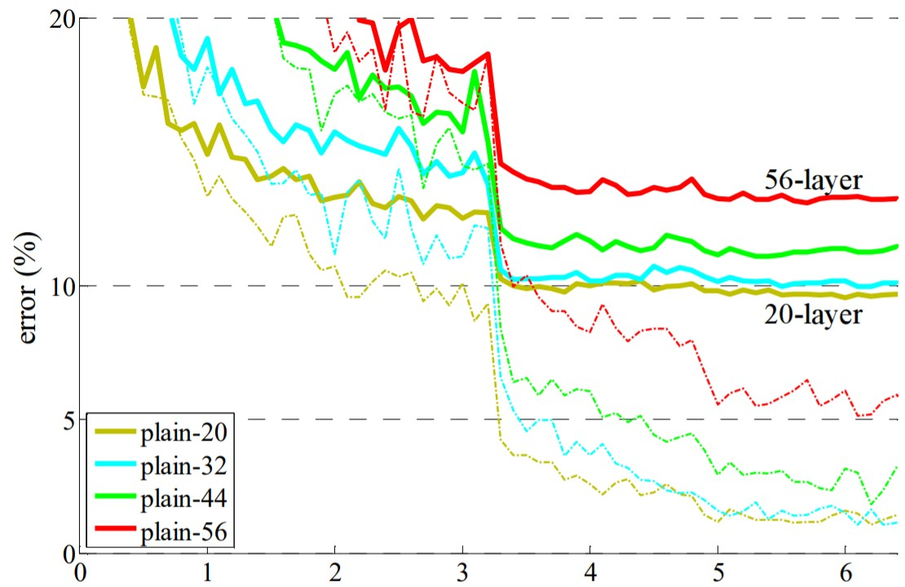
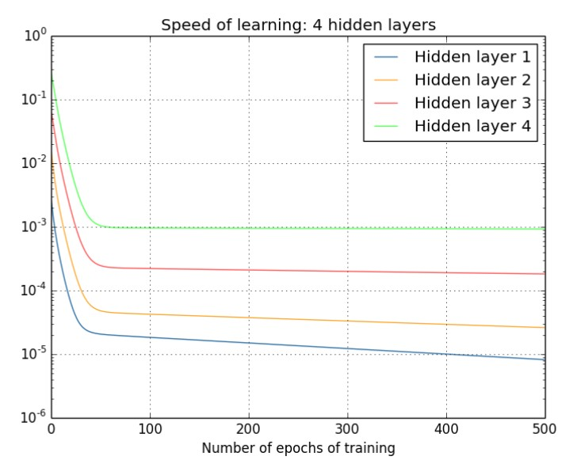
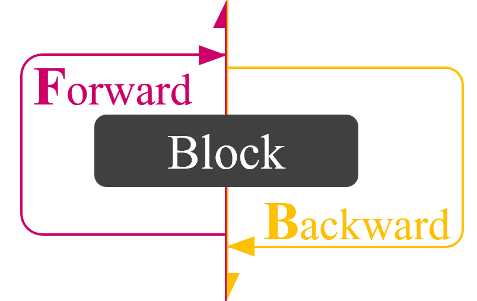
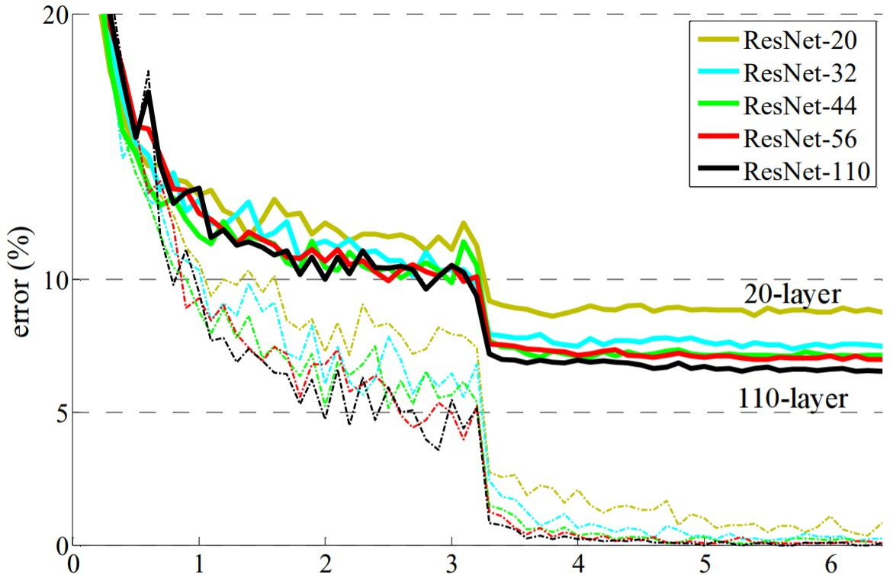

- [Deep Residual Learning for Image Recognition](https://arxiv.org/abs/1512.03385)
- [Identity Mappings in Deep Residual Networks](https://arxiv.org/abs/1603.05027)
- ## 背景
	- 若設計的 DL 模型層數太深，在訓練時就會發生 [Gradient Vanishing](((62ea0b90-37aa-406a-ab2e-4cb5cb9cc2c1)))
	  導致更深更大的模型效能反而不如較小的淺層模型
	- {:width 400}
		- 不論是訓練還是測試，都呈現模型越深錯誤率越高
	- {:width 400}
		- 接近輸入層數的梯度遠小於靠近輸出層數的梯度，明顯出現了梯度消失的問題
		  導致難以訓練深層模型
- ## 方法
	- ```python
	  def res_block(x, block):
	    return x+block(x)
	  ```
	- 透過一條 shortcut 將 block 的輸出與輸入相加
		- {:width 500}
		- 如此便能在 backward 時建立一條不會受到影響的梯度流
		  以此解決梯度消失的問題
	- {:width 400}
		- Residual 機制的輔助，使深層模型具有更佳的效能