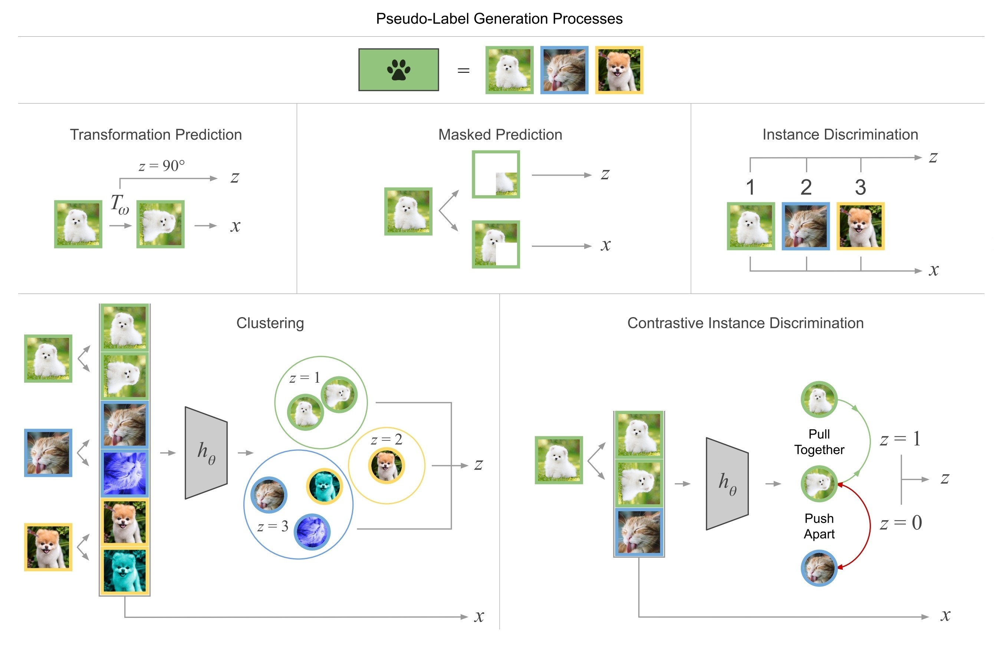

- ## Survey
	- [A Survey on Contrastive Self-supervised Learning](https://arxiv.org/abs/2011.00362), 2020
	- **[Self-Supervised Representation Learning: Introduction, Advances and Challenges](https://arxiv.org/abs/2110.09327), 2021**
		- 
	- [Self-Supervised Learning for Videos: A Survey](https://arxiv.org/abs/2207.00419), 2022
	- [Survey on Self-Supervised Learning: Auxiliary Pretext Tasks and Contrastive Learning Methods in Imaging](https://www.mdpi.com/1099-4300/24/4/551), 2022
	- [Self-Supervised Speech Representation Learning: A Review](https://arxiv.org/abs/2205.10643), 2022
- ## 背景
	- > 與 [Semi-Supervised](((62f12695-556d-476b-b1ef-8db46a1f222a))) 相同
	- 標記資料（$D$）相對稀少且成本高昂
	- 現實世界充滿大量的未標記資料（$U$）卻難以善加利用
- ## 特點
	- > 與 [Semi-Supervised](((62f1ece2-6a74-41f7-be39-9faf29a5b19d))) 重疊
	- 可以在測試環境中持續訓練 #[[Transductive Learning]]
	- 有效利用大量的未標記資料
		- 預訓練時無需任何 label
	- 目標是訓練強大的 Pre-trained Feature Extraction
		- 使用 Self-Supervised 得到的 features 只靠**線性分類器**或是 **k-nearest neighbors**（k-NN）就能有不錯的分類結果
		- 適合遷移到不同的下游任務
	- ### vs Semi-Supervised
		- Semi-Supervised 還是需要少量的標記資料一起訓練
		  而 Self-Supervised 則是在 pretrain 時不使用任何標記資料
- ## 主流方法（未完成）
	- ### Transformation Prediction
		- {:width 400}
	- ### Masked Prediction
		- {:width 400}
		- #### 特點
			- 將部分輸入遮蔽掉，並訓練模型能還原這部分的輸入
			- 遮蔽的資訊量影響任務的難易度
		- BERT
		- wav2vec 2
	- ### Clustering
		- {:width 500}
	- ### Contrastive Instance Discrimination
		- {:width 500}
		- #### 特點
			- 使用 negative sample 與 Data Augmentation 生成的 positive sample 訓練
			  讓 positive 互相逼近並遠離 negative sample
			- 需要較大的 batch size 容納大量的 negative sample
			- 不易發生 collapse
			- > collapse：所有輸入都會產生同一個 feature vector
		- SimCLR
		- MoCo
		- wav2vec 1&2
	- ### Instance Discrimination
		- {:width 400}
		- #### 特點
			- 不像 Contrastive Instance Discrimination 需要定義 negative sample，
			  Instance Discrimination 只使用 positive sample 進行訓練，
			  因此只需要更小的 batch size 就能夠訓練，但容易因設計不良而發生 collapse
		- [[SimSiam]]
		- [[BYOL]]
		- [[DINO]]
- ## Trick
	- > Self-Supervised Learning 大多都有非常多的 trick，在實作前一定要詳閱論文的說明與設定
	- Momentum Encoder
	- Projector & Predictor
		- 為什麼要 projector: [Understanding and Improving the Role of Projection Head in Self-Supervised Learning](https://arxiv.org/abs/2212.11491)
	- Batch Normalization
	- Data Augmentation
	- Memory Bank
	- Sinkhorn-Knopp