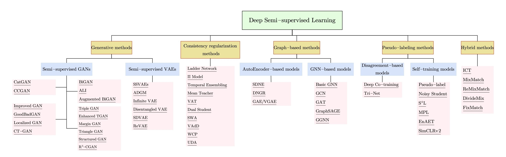

- ## Survey
	- [An Overview of Deep Semi-Supervised Learning](https://arxiv.org/abs/2006.05278), 2020
	- [A Survey on Deep Semi-supervised Learning](https://arxiv.org/abs/2103.00550), 2021
		- 
- ## 背景
	- 標記資料（$D$）相對稀少且成本高昂
	- 現實世界充滿大量的未標記資料（$U$）卻難以善加利用
- ## Pseudo Label
	- 使用 $D$ 訓練初始模型 $f_{\phi}$
	- loop:
		- 用 $f_{\phi}$ 幫助 $U$ 標上 pseudo label 變成 $U'$
		- 將 $D$ 與 $U'$ 加上 [[Data Augmentation]] 後訓練新模型 $g_{\phi'}$
		- 用新模型 $g_{\phi'}$ 取代舊模型 $f_{\phi}$