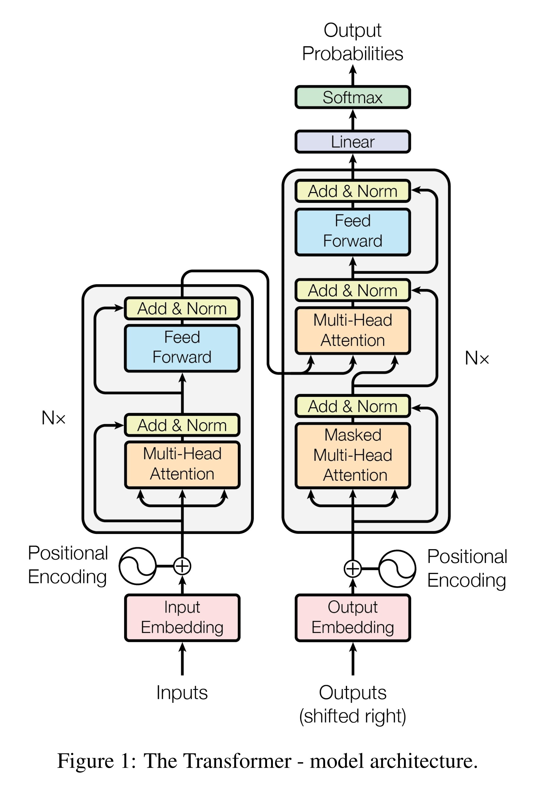
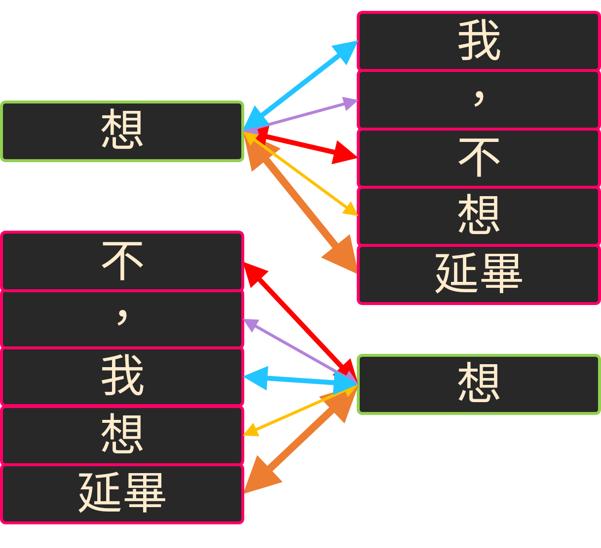
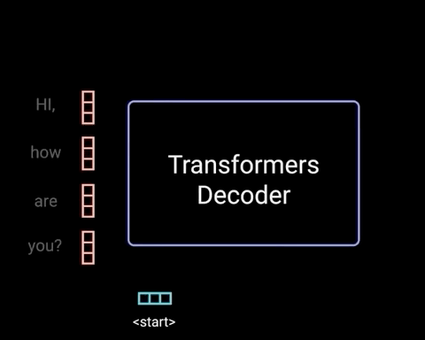

- [Attention is all you need](https://papers.nips.cc/paper/2017/hash/3f5ee243547dee91fbd053c1c4a845aa-Abstract.html), NIPS, 2017
- ## 前置
	- [[seq2seq]]
	- [[Autoregression]]
	- [[Transformer Block]]
	- [[Positional Encoding]]
- ## 特點
	- {:width 400, :height 595}
	- Transformer 是由 [[Multi-Head Attention]] 構成的 Seq2Seq 架構
	- 利用 Multi-Head Attention 取得全域級別感受野的資訊
	- 在輸入加上 Positional Encoding 來幫助模型理解位置資訊
		- {:width 300}
		  **我，不想延畢 == 不，我想延畢**...？
			- 在沒有外加資訊的情況下
			  Multi-Head Attention 無法判斷不同位置有什麼不一樣
		- 延伸：[[Length Extrapolatable]]
- ## 應用於 Machine Translation
	- 1. Encoder 輸入來源語言的句子，並轉換成特徵 $m$
	- 2. 將翻譯目標語句與 start token 串聯作為 Decoder 的輸入
	- 將 1. 的 $m$ 與 2. 輸入 Decoder，並以 Autoregression 的形式訓練
	- 
		- [Illustrated Guide to Transformers- Step by Step Explanation](https://towardsdatascience.com/illustrated-guide-to-transformers-step-by-step-explanation-f74876522bc0)
		- 在推理時由於 Autoregression 的性質，只需要輸入來源語言的句子與 start token 便能開始翻譯
- ## 補充
	- https://www.tensorflow.org/text/tutorials/transformer
	- [[Efficient Transformers]]
	- LATER [Stabilizing Transformer Training by Preventing Attention Entropy Collapse](https://proceedings.mlr.press/v202/zhai23a.html)
		- 讓 Transformer 穩定訓練的方法