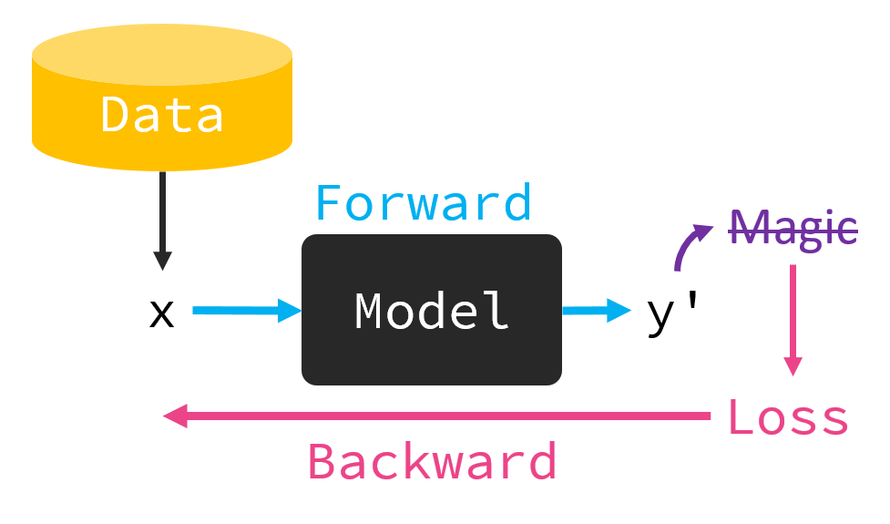

- {:width 400}
- ## 特點
	- 沒有人工標記的 label
- ## 方法
	- ### Generative Models
	  id:: 63501ad2-ac08-440d-9013-83ce7081d17f
		- GAN #GAN
		- AutoEncoder #AE
		- Flow-based Models
			- [Flow-based Deep Generative Models](https://lilianweng.github.io/posts/2018-10-13-flow-models/)
		- Diffusion Models #DPM
			- [What are Diffusion Models?](https://lilianweng.github.io/posts/2021-07-11-diffusion-models/)
			- [Awesome-Diffusion-Models](https://github.com/heejkoo/Awesome-Diffusion-Models), github
			- [Elucidating the Design Space of Diffusion-Based Generative Models](https://arxiv.org/abs/2206.00364), arXiv, 2022
		- Autoregressive Models #Autoregression
			- Non-AR
			- Partial-AR
	- ### Self-Supervised Learning #Self-Supervised
-